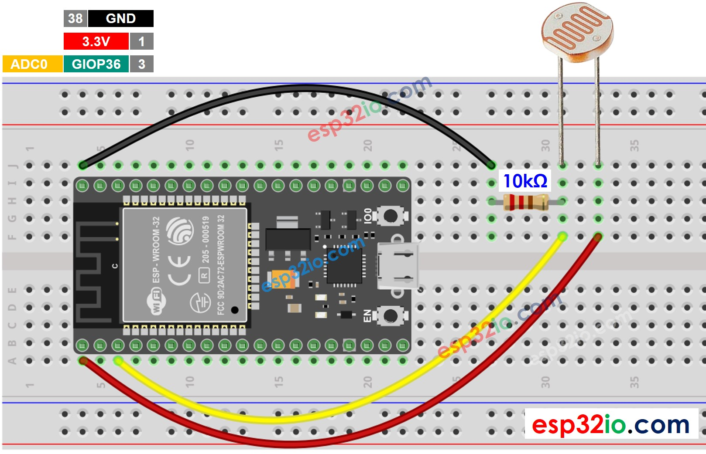

# LAB 2 - Sensors
**Total tasks:** 5 (1 in-lab, 4 take-home)

**Deadline:** Mar 9, 24 midnight

**Submission instructions:** Submit the `.ino` files, for all the tasks in the format `TaskX.ino`, where `X` is the task number. Submission tab will be made available on LMS. For the in-lab tasks, tasks submitted on dropbox will be considered.

## In-lab tasks:
### Task 1 - Security system with utlrasonic distance sensor:
Your first task is to implement a simple intrusion detection system. Suppose your implementation will be used with a door, and the micro-controller uses an LED light to indicate whether your secret is safe or not. The LED should blink green under normal circumstances; however, if someone unauthorized tries to cross the room, the LED should start blinking RED. Now this LED should keep on blinking RED until someone takes action (add a simple push-down button, which, once pressed, resets the LED back to normal).​

You may find the source file `sonar-demo.ino` helpful as a starting point.

### Task 2 - Plant monitoring system using temperature and humidity sensor:
- For the second task, you are required to implement a simple plant monitoring system. Your plant needs access to the sunlight, as well as good humidity and temperature, (all of which exist within a limited range) For that, you can use the trusty old DHT11 sensor. Use an RGB LED to show status of the current environment of the plant : Display green if in the favorable range (both temperature and humidity), display yellow if the temperature is below the lowest allowable temperature (given range T_0 – T_1, display yellow if T_curr < T_0), and display red if both are outside the favorable range.​
- ​Note that the ranges can be arbitrary, during checking different ranges will be tested, so don't use hardcoded values.​
- You may find the source file `DHT-demo.ino` helpful as a starting point.

## Note:
Note that as per the consensus during the lab, you were supposed to submit atleast one of the tasks by midnight of Thursday. Therefore, the one that wasn't submitted becomes a take-home task, and will be graded accordingly.

## Take-home tasks:
### Task 3 - Actuation with readings from an LDR:
LDR (short for Light Dependent Resistor) can be used to sense the relative presence or absence of light. Also known as a "photoresistor", or a "photocell", LDR is a passive component that varies its resistance based on the luminosity of the light incident to its surface. The resistance of a photoresistor decreases with increase in incident light intensity; in other words, it exhibits photoconductivity.

The physical property of the LDR that changes directly is the resistance, which can't be directly measured by a microcontroller, however, MCUs can easily measure voltage; they have built-in ADCs. For example, find the ADC enabled pins for the ESP32, from the following:


Here's how an LDR can be interfaced with an ESP32. Note that the polarity of the terminals is irrelvant, its essentially symmetric. The corresponding voltage change is provided by the potentiometer configuration of the LDR, and a fixed resistance. Output voltage is proportional to the resistance of the LDR, and the pull-up resistor.



We can then read the sensor value as follows:
```c++
#define LDR_PIN 15
...
void loop() {
    auto analogValue = analogRead(LDR_PIN);
    Serial.printf("Read value: %d\n", analogValue);
...
}
```

Now, you are tasked with installing an emergency light system for your own room, by yourself. However, it needs to be prototyped first. 

You essentially need to build a program that reads from an LDR sensor and controls an LED (for the prototype). You can then replace the LED by a relay switch controlling a battery powered bulb during the actual deployment. Similarly, the power can also be provided via a battery or some other energy source.

*Note that* the LDR value will vary from 0-4095 (default ADC config, `0 - 3.3V => 0 - 4095 ints`). You only need to build the supposed "prototype".

### Task 4 - Sending data over... light?
In this task, let's try to extend the light sensing capabilities of an LDR, and a simple LED light to build a simple Light Fidelity based transmission medium. 

If the LED can be controlled to blink with certain patterns, we can induce different voltage levels at the LDR pin. Specifically, if the ambient light is low enough, and is removed as noise from the data, and if the LED is directly facing the LDR, we can detect flashes of pattterns of light as rapidly falling and increasing values.

<!--  -->


*Placing LED and LDR directly opposite to each other for better transmission(LED : row 20, 25) and reception (LDR : row 25, 28)*

One can easily write a simple multi-threaded application that can handle this. One thread can drive the LED (or the transmission side), and the other thread can drive the LDR (or the receiving side). Here's a quick little outline. A minimal working example can be found in `sendDemo.ino`.
```c++
#define LIGHT_SENSOR_PIN  15 // ADC enabled
#define LED_PIN           23

// setup the handling of gpios, thread creation etc.

void sendBit(bool bit)
{
    digitalWrite(LED_PIN, bit);
}
// ..
// will run in the separate thread
void sendMessage()
{
    for (;;)
    {
        bool bit = random(0, 2); // 0 or 1
        sendBit(bit);
        // protocol specified delay
        delay(LED_DELAY);
    }
}
// ...
// ...
// somewhere inside loop()
void loop()
{
    // ...
    Serial.println(analogRead(LIGHT_SENSOR_PIN));
    // delay(LED_DELAY); // sample after protocol specified delay
}
```

And, using the "Serial Plotter" tool available in the arduino IDE (in the top right corner, next to "Serial monitor"), we get a pseudo-digital signal back at the receiving end, (in another thread, on the same processor).


Unfortunately, the serial plotter doesn't allow me to resize/zoom out of the x-axis. But, the y-axis can be fixed by printing a constant upper and lower bound value. Serial plotter plots values being printed to the serial. So, we can use:
```c++
Serial.print(3000); // To freeze the lower limit
Serial.print(" ");         // space is used as the separator
Serial.print(0); // To freeze the upper limit
Serial.print(" ");
// finally print the sensor value
Serial.println(analogRead(LIGHT_SENSOR_PIN));
```

We can limit reads and writes by using the same delay between sending and reading two values. (or the sampling rate is equal to the transmission frequency). Then, we get something like this:


*Each sampled point represents a sent value. We can compare each value to some threshold level to find the bit.*

For this task, your job is to implement the following two functions:
- `void sendData(uint8_t* buf, int size)`
  - Sends the bytes in the byte array `buf` of size `size`. It might help to write a `sendByte` function first, which sends only a single "byte (8 bits)".
- `void receiveData(uint8_t* buf, int size)`
  - Receives and puts the received bytes in the bytes buffer `buf`. 

Using the functions you wrote above, write a simple arduino program that:
1. Takes input bit pattern to send via serial. e.g. (01001 etc.)
2. Sends the bit pattern using the function you wrote.
3. Asynchronously listen for data on the other thread, and when the bit pattern specfied by you is received, print that.

On the serial plotter, it might look something like this:


*The bitstring 10101010 sent over serial to LDR.*

Note that, sometimes, you might encounter some strange artifacts like this:


*Tried to send the bit pattern `fe` or (11111110) which gets interpreted as `0f` and `e0` since the receiver is reading continuously.*

Since the receiver doesn't know when the transmission has started, or ended, it must be sensing continuously. Therefore, it doesn't know whether the message sent started from the nibble `f` or `0`. 

One easy work around a problem like this is using a larger receive window at the receiver, and using some specific bit-pattern to specify the start of the communication. Make sure the window size is large enough to accomodate both the message and the starting markers.

## Task 5:
This task is simply an extension of the previous task, and instead of sending binary data over LED, let's try to send strings now. The underlying "drivers" were written by you in Task 4, and now those "drivers" can be used to write high level applications. 

Modify task 4 so that it can read strings like "hello world", "lmao" etc. from serial, and sends them via the LED. The receiving end should then print the received string over serial.

*Note* that, this communication setup is independednt, so, technically, we can communicate with an other ESP32 as well, by simply placing the LED in front of the LDR connected to the other ESP32, without changing any of the connections. This way, two way communication can be easily established, since both ends are capable of both transmission and reception. You are welcome to experiment with that.